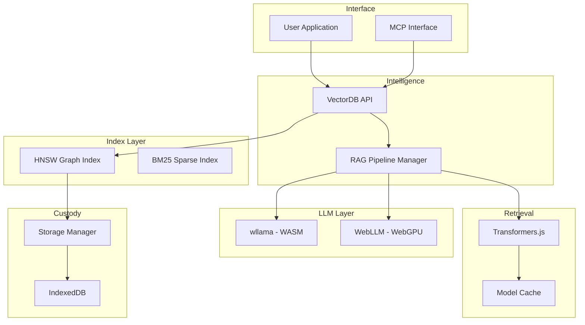

<div align="center">

<br>

<h1>
  
</h1>

**Your data, domiciled on your device.**

On-prem privacy, in the browser — vector database, RAG, and local LLM. All processing stays client-side, with zero egress.

[](https://www.npmjs.com/package/@kyrillosishak/domicile)
[](./LICENSE)

</div>

---

## Why Domicile?

Domicile is a private AI stack — vector database, RAG, and a local LLM that runs entirely in the browser. On-prem-grade data custody and privilege protection, without the on-prem infrastructure. Your documents never leave their legal residence.

- **Private**: Data never leaves the device — zero egress, zero third-party processors
- **Fast**: WebGPU acceleration with WASM SIMD fallback
- **Free**: Zero cloud costs, no API keys, no per-seat fees
- **Complete**: Vector DB + embeddings + dual LLM + RAG with citations
- **Offline**: Works without internet after initial load

## Quick Start

```bash
npm install @kyrillosishak/domicile
```

```typescript
import Domicile from 'domicile';

// A private, in-browser custody layer
const db = new Domicile({
  storage:   { dbName: 'matter-files' },
  index:     { dimensions: 384, metric: 'cosine' },
  embedding: { model: 'Xenova/all-MiniLM-L6-v2', device: 'webgpu' },
});

await db.initialize();

await db.insert({
  text: 'Privileged communication — attorney work product',
  metadata: { matter: 'M-204', privilege: 'true' },
});

const results = await db.search({ text: 'summary of work product', k: 5 });
console.log(results);
```

## Features

- **Vector Database**: Persistent client-side storage in IndexedDB with a pure-TypeScript HNSW graph index. Hold and search 100K+ documents with cosine, euclidean or dot metrics — real similarity scores, non-rebuilding deletes — all in residence on the device.
- **Local Embeddings**: Transformers.js with WebGPU acceleration and a WASM fallback. Model weights cached on-device, so repeat queries never reach the network.
- **Dual LLM Runtime**: WebLLM for GPU-fast inference, Wllama for CPU portability — automatic fallback so generation works on any workstation.
- **RAG with Citations**: Answers grounded in your source documents, with citations linking every claim back to the document that grounded it — auditable, not black-box.
- **MCP Integration**: Expose your custody layer as Model Context Protocol tools — wire Domicile into Claude Desktop and the agent stacks your team already builds on.
- **Resident by Design**: Data domiciled on the device — no cloud egress, no third-party processors, no residency drift. The boundary is architectural, not a configuration someone can forget to check.

## For Whom

**Law Firms & Legal Teams** — Sensitive matter files, privileged communications, and client data never leave the workstation. Domicile runs RAG and generation locally, so attorney-client privilege is never routed through a third-party cloud. GDPR-compliant by construction, works offline.

**Integration & Infra Teams** — The custody layer you offer clients who want on-prem guarantees without on-prem capital expense. Ship it inside their app, configure residency, walk away — no servers to run, no data plane to secure.

## Core Features

### Vector Search
```typescript
// Retrieval with metadata filtering
const results = await db.search({
  text: 'indemnification clauses',
  k: 10,
  filter: { field: 'matter', operator: 'eq', value: 'M-204' },
});

for (const r of results) {
  console.log(r.score.toFixed(3), r.metadata);
}

// Inspect custody state
const stats: IndexStats = await db.stats();
console.log(stats.vectorCount, stats.memoryUsage);
```

### RAG Pipeline
```typescript
import { RAGPipelineManager, WllamaProvider } from 'domicile';

const llm = new WllamaProvider({ model: '...' });
const rag = new RAGPipelineManager(db, llm, embedding);

// Ask questions grounded in your documents
const result = await rag.query('Summarize the position.', {
  topK: 3,
  generateOptions: { maxTokens: 256, temperature: 0.7 },
});

console.log(result.answer);
console.log(result.sources); // Cited source documents
```

### MCP Integration
```typescript
import { MCPServer } from 'domicile';

// Expose your custody layer as tools for AI agents
const mcp = new MCPServer(db, rag);

const tools: MCPTool[] = mcp.getTools();
// → [search, insert, rag_query, ...]

// Wire into Claude Desktop or any MCP-aware agent
mcp.serve({ transport: 'stdio' });
```

## Architecture

A layered, resident-by-design stack. Each layer is swappable and runs without a server. Data flows down; answers flow up — all on the device.

- **Interface**: Your application talks to a clean TypeScript API, or to AI agents over MCP — Claude Desktop, ChatGPT, anything that speaks the protocol.
- **Intelligence**: The RAG pipeline manager orchestrates retrieval and generation, with WebLLM and Wllama runtimes and automatic GPU-to-CPU fallback.
- **Retrieval**: Transformers.js produces embeddings; the pure-TS HNSW index returns nearest neighbours with real scores. A BM25 sparse index fuses with dense via reciprocal-rank fusion, and a cross-encoder reranker sharpens the top-k — all filtered by metadata.
- **Custody**: IndexedDB storage manager with quota-aware eviction and JSON/binary export-import for migration and client hand-off.
- **Acceleration**: GPU compute when WebGPU is available, WASM SIMD fallback otherwise, with a worker pool for batched parallelism.
- **Reliability**: A typed error hierarchy, LRU caches, a memory manager, and a built-in benchmark runner to measure it all.



## Performance

Reproducible from `domicile bench` — the same suite that gates the build. Measured on a Linux/server CPU (Node); a browser WebGPU run will differ.

| Operation | Latency | Throughput / Quality | Notes |
|-----------|---------|----------------------|-------|
| Search (10K vectors, 128-dim cosine) | p50 2.4ms / p99 7ms | recall@10 = 0.91 | Pure-TS HNSW, warm cache |
| Search (1K vectors, 128-dim cosine) | p50 1.4ms / p99 1.8ms | recall@10 = 1.00 | Non-rebuilding delete <0.01ms |
| Citation accuracy (legal known-answer corpus) | — | recall@3 = 0.92 | Dense + hybrid + rerank retrieval |
| RAG query (full pipeline) | retrieval + generate | streaming | Local LLM, browser-bound |

*Reproduce: `npm run build && node dist/cli/index.js bench`*

## Development

```bash
# Install dependencies
npm install

# Run tests
npm test

# Run tests in watch mode
npm run test:watch

# Run integration tests (requires network)
npm run test:integration

# Build library
npm run build

# Type check
npm run type-check

# Run benchmarks
npm run benchmark
```

## Browser Support

- **Chrome/Edge**: 90+ (WebGPU: 113+)
- **Firefox**: 88+ (WebGPU: Not yet supported)
- **Safari**: 14+ (WebGPU: Not yet supported)

**Requirements:**
- IndexedDB support
- WebAssembly support
- ES2020+ JavaScript

**Optional:**
- WebGPU for accelerated inference
- SharedArrayBuffer for multi-threading

## Roadmap

- Python bindings (PyScript)
- React hooks package
- Hybrid search (dense + sparse)
- Multi-modal embeddings (CLIP)
- Quantization in browser

## Contributing

Contributions welcome. Please open an issue or PR.

## License

MIT © 2026

---

<div align="center">

**[Documentation](./docs/QUICKSTART.md)** • **[Examples](./examples/README.md)** • **[GitHub](https://github.com/kyrillosishak/Domicile)**

Built for privacy-conscious legal and integration teams

</div>
